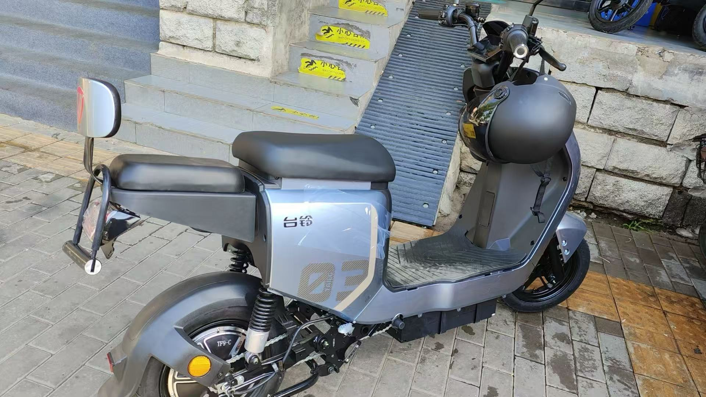
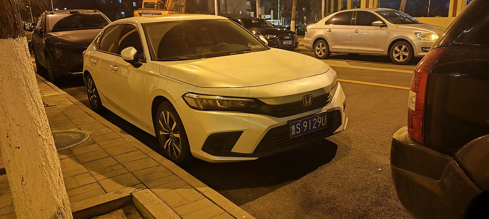
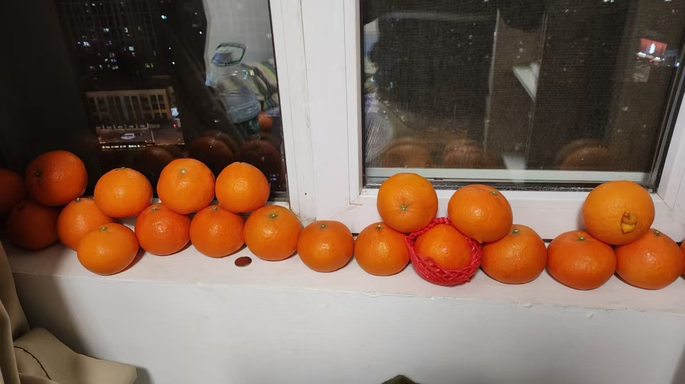
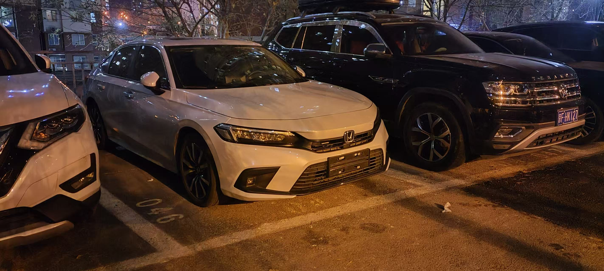
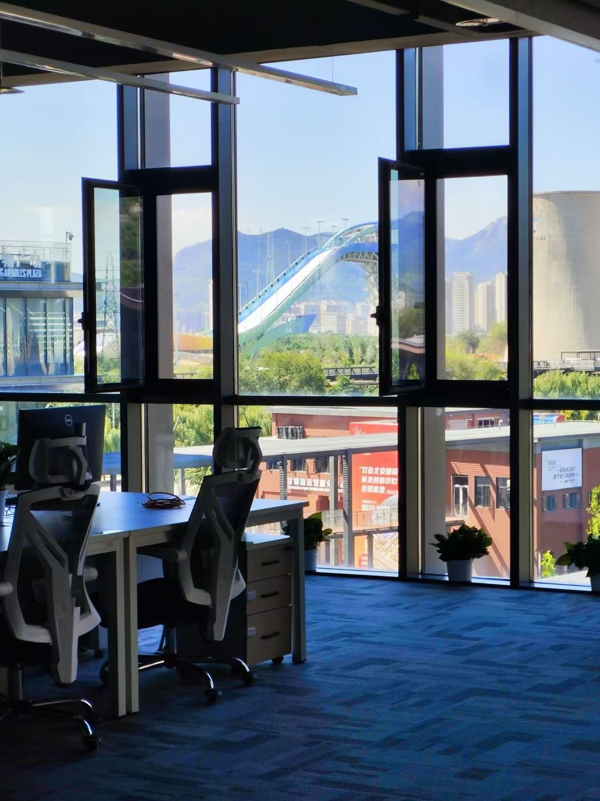
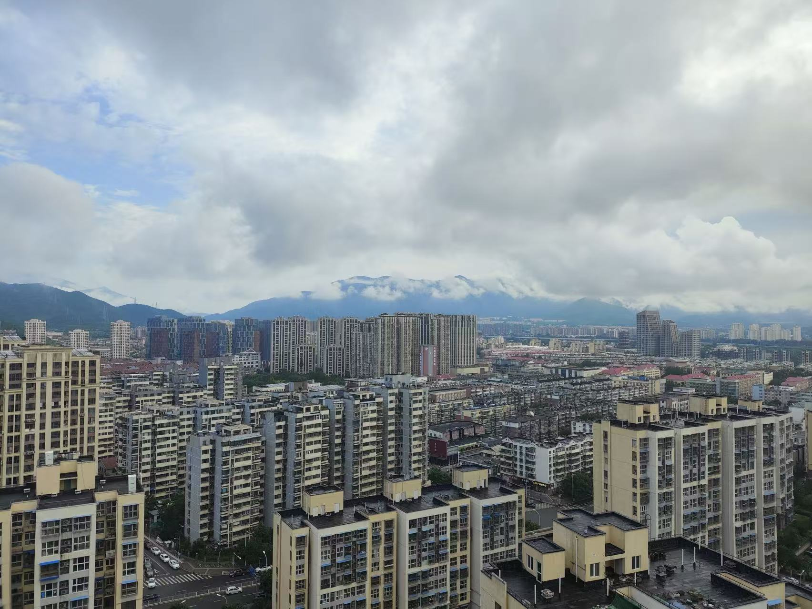
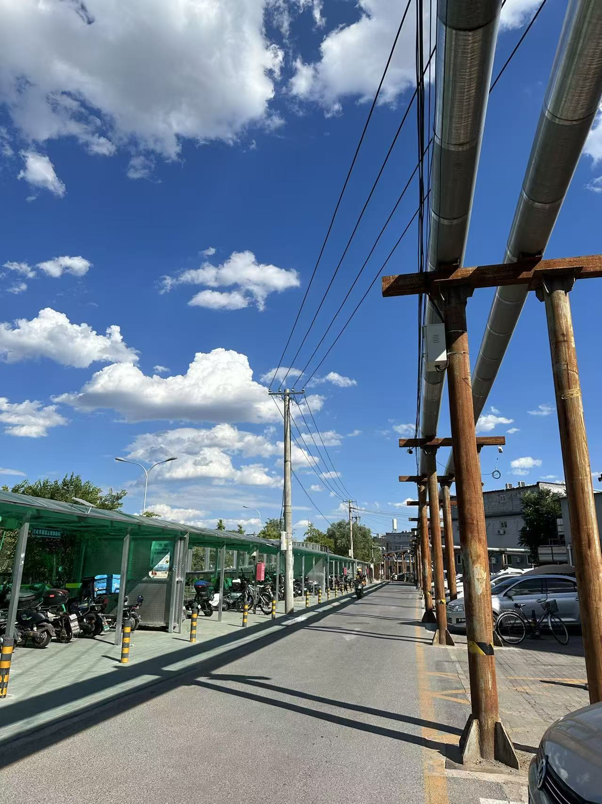

2023年在北京的那段日子，现在回想起来，像是一卷洗出来的旧照片——画面还在，但边角已经微微发黄，带着一点距离感，又有一点怀念。

## 初到北京

那一年决定来北京，多半是冲着机会多、行业集中。另外一个原因是我小时候来过北京，因为父母在北京务工，寒暑假时可以在北京待一段时间短暂的和父母相聚。

我正式来到北京的日子是毕业季，6月15号的下午我从南站出来，租了一间房子，租房子的时候那个房东是一个山东嫁过去的女人，脾气很好，看我是老乡便多聊了几句。

后来我又看上了一个龙山家园的房子，那边是回迁房，是自如的房子，房子只有几平米，大概是6平米不到。

租完房子后第二天我就去了公司报道。在不久的一段时间后我便买了一辆电动车，电动车不错，至今还在我爸那里服役。

## 工作与日常

工作上的事，现在能想起来的，都是一些琐碎的小事，当时以为天大的事情，现在回想起来不过是时空中的一粒沙一样不起眼。

公司最早是在石景山的一个工业园，后来搬到首钢原来，石景山那边中午下班的时候经常吃一顿排骨，刚到北京感觉那个特别好吃，后来胃口变得叼了，现在回想起来不过是预制菜罢了。当时刚工作，回想起来当时的满足感还是别有一番趣味的。

搬到石景山的首钢园后，午饭经常吃的是一家刀削面。也是最便宜的。在首钢园有时候下去吃，有时候点外卖，记得有一次点外卖也是下面哪一家面馆的餐时，点了一份宫保鸡丁，他竟然把菜扣下去了，像是剩饭一样。后来才知道是厨师以为是堂食，后来又倒腾了一个外卖餐盒。但是我给他打了一个大大的差评，宫保鸡丁扣下去真的很像猪食。

在北京上班，我基本上没有坐过地铁，我喜欢骑电动车，冬天的时候电动车很受罪，那个时候特别冷，但是没有买手套，有一双薄薄的手套坚持了一个冬天，当时为了不被风吹透，手上还套一个黑色的垃圾袋。

北京的这家公司是一个军工性质，内网开发，很不好受，一个简单的文件导入导出需要来回刻光盘，审批，麻烦至极。

其中的领导也是半瓶子水，但是年长不少，会来事，深受二把手领导喜欢。他呢，什么也不会，喜欢瞎指挥。经常网上随便搜一个东西然后让我们做。

同事相处还算融洽，因为是应届生居多，大多数都能聊得来，有来自潮汕的、河南的、河北的。

## 离开与回望

后来因为各种原因离开了北京。走的时候没有特别仪式感，就是退租。再后来，2023年就真的变成了「那一年」。

偶尔会想起北京的天气、某条常走的路、某家常去的店，或者某次加班到很晚、从公司出来时看到的夜空。这些碎片拼在一起，就成了我对那一年北京工作日的全部回忆——说不上多轰轰烈烈，但真实、具体，也值得被写下来。

但无论我怎么写，都写不全，有些记忆注定要消失，本篇的博客也一样。某时某刻就从硬盘上消失了吧。

---

*写于日后某日，谨以此文留作2023年北京时光的注脚。*

